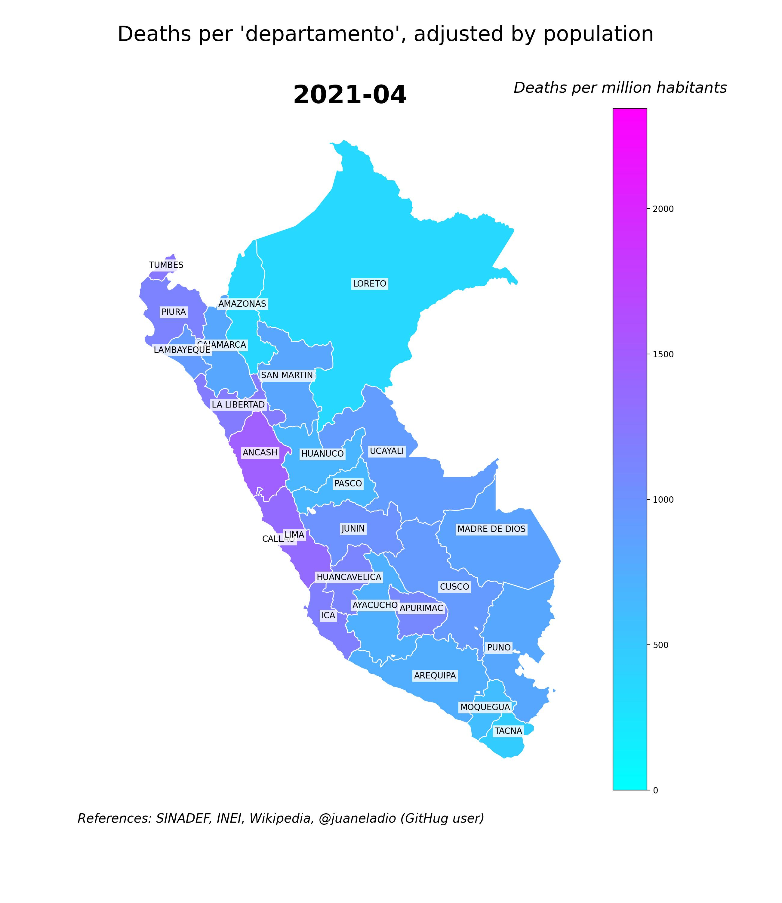

Peru: Two Years of COVID-19

# Peru: Two Years of COVID-19

A very simple analysis of the impact of COVID-19 in Peru with Pandas, Geopandas and Matplotlib in Python using Jupiter Notebooks

### How hard has COVID-19 struck a city / country / region?

One way to address this question is to take a look at the deaths, or more precisely, the excess mortality caused by the virus.

In this occassion, we desire to make a very simple analysis of the effects of COVID-19 in each "departamento" (sort of equivalent to a U.S. State) of Peru by looking at mortality levels throughout 2020-2022.

In order to do that, we are going to create **choropleth maps** with monthly deaths (adjusted by population) ocurred in a given month since 2020-01 for each "departamento", and display these maps through a .gif.

We are going to work with the national deaths database of Peru, SINADEF, and the GeoJSON data of this country, available [here](https://github.com/juaneladio/peru-geojson).

We are going to make use of a handful of data science Python libraries such as Pandas, Geopandas, Matplotlib and Numpy. You might want to run this project inside a Conda environment or just create a venv and run `python -m pip install -r requirements.txt`.

At the end of this project, we are going to be in good position to appreciate not only the evolution of the Pandemic in Peru for the past two years, but also to retrieve a couple of handful pieces of information such as the most most affected "departamento"s, the heaviest-hit "departamento" in a given month and the worst month of the pandemic. Moreover, our findings will make complete sense when compared to what was reported by public media and health authorities.

